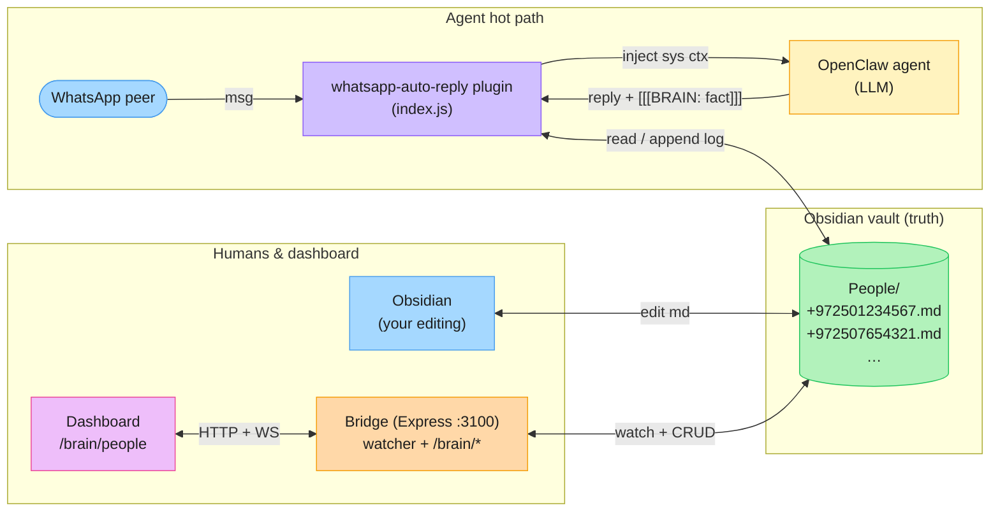

# Brainclaw — Obsidian Vault Integration (Phase 1: People)

## Goal
Connect OpenClaw to an Obsidian vault at `C:\Users\GalLe\Documents\Brainclaw\OpenClaw Brain` so that everything the agent learns and works with lives there — as the single source of truth shared by the agent, the dashboard, and the user editing notes in Obsidian.

## Phase 1 Scope (this spec)
Only the `People/` area. A per-contact markdown note per WhatsApp peer. The agent reads it transparently before replying, and can append facts explicitly. The dashboard mirrors the vault with live updates.

Deferred to later phases: `Conversations/`, `Sessions/`, `Knowledge/`, `SOPs/`, cross-note wikilink synthesis, full-text brain search, MCP exposure.

## Architecture

Rendered (Excalidraw, hand-drawn, editable): [open in excalidraw.com](https://excalidraw.com/#json=l4HiRm9ndG7acbcuDuEsj,s0LdubuGO_dfQBC9BNWwog)

Inline (renders in Obsidian, GitHub, VS Code with Mermaid preview):



Key invariants:

- Shared package `@openclaw-manager/brain` encapsulates all vault I/O.
- Plugin imports it directly (no HTTP on the hot path) — every WhatsApp reply stays fast.
- Bridge imports it, exposes HTTP, owns the **single** file watcher (one chokidar instance avoids duplicate events across processes).
- Dashboard connects to existing `/ws` → `/api/events` SSE pipeline for live refresh — no new transport layer.

## Vault Layout

```
C:\Users\GalLe\Documents\Brainclaw\OpenClaw Brain\
  Welcome.md                    (existing, untouched)
  People/
    +972501234567.md
    +972507654321.md
    ...
```

Filename = `+<E.164>.md`. Stable primary key, matches WhatsApp JID. Frontmatter aliases surface the display name in Obsidian's graph.

## Note Schema

```markdown
---
name: Alice Cohen
aliases: [Alice Cohen, Alice]
phone: "+972501234567"
jid: 972501234567@s.whatsapp.net
tags: [person]
created: 2026-04-17
last_seen: 2026-04-17
relationship: customer
language: he
status: active
---

# Alice Cohen

## Summary
_One paragraph the agent can rely on._

## Facts
- Lives in Tel Aviv

## Preferences
- Hebrew only

## Open Threads
- Waiting on pricing proposal (since 2026-04-10)

## Notes
_Free-form. Agent ignores below this line._

## Log
- 2026-04-17T10:03 — First contact
```

**Injected to agent:** everything above the literal line `## Notes` (i.e. frontmatter summary + Summary + Facts + Preferences + Open Threads). `## Notes` and `## Log` and anything below are stripped from the injection.

## `brain.note` Mechanism (Phase 1)

The agent includes `[[[BRAIN: <fact>]]]` anywhere in its outbound reply. The plugin:

1. Extracts all matches from the outbound text.
2. Strips them from the reply before the message is sent.
3. Appends each match to `## Log` as `- <ISO timestamp> — <fact>`.

This is cheaper than SDK tool registration and gives the agent a simple, reliable write mechanism. Upgrade path: promote to a real tool in Phase 2.

## Types (`@openclaw-manager/types`)

```ts
export type BrainPerson = {
  phone: string;               // "+972501234567"
  jid: string | null;
  name: string;
  aliases: string[];
  tags: string[];
  relationship: string | null;
  language: string | null;
  status: "active" | "archived" | "blocked";
  created: string | null;      // ISO date
  last_seen: string | null;    // ISO date
  // Body sections
  summary: string;
  facts: string[];
  preferences: string[];
  openThreads: string[];
  notes: string;
  log: string[];
  raw: string;                 // full markdown
};

export type BrainPersonSummary = Pick<
  BrainPerson,
  "phone" | "name" | "relationship" | "language" | "status" | "last_seen" | "tags"
>;

export type WsMessageType = ... | "brain_person_changed" | "brain_people_changed";
```

## Bridge API (new)

| Method | Path | Purpose |
|--------|------|---------|
| GET | `/brain/people` | List all people (summary rows) |
| GET | `/brain/people/:phone` | Full person note |
| PATCH | `/brain/people/:phone` | Update frontmatter fields + body sections |
| POST | `/brain/people/:phone/log` | Append a log line |
| POST | `/brain/people` | Create stub (phone required) |

File watcher fires → `/ws` broadcasts `{ type: "brain_person_changed", payload: { phone } }`.

## Dashboard

New sidebar section **Brain** → **People**:

- `/brain/people` — list view: name, phone, relationship, last_seen, status. Click to open detail.
- `/brain/people/[phone]` — detail view: renders frontmatter as a header card + each markdown section, plus an inline editor for Summary / Facts / Preferences / Open Threads. Log is read-only append-only. Live-refreshes on `brain_person_changed` events.

## Plugin Changes

In `whatsapp-auto-reply/index.js`:

1. Import from `@openclaw-manager/brain` (via a relative path — the plugin doesn't share the monorepo's node_modules, so ship a built copy or resolve via `BRAIN_VAULT_PATH` env + inline lightweight reader). **Decision: inline a trimmed reader in the plugin to avoid cross-process module resolution complexity. The plugin only needs: `ensureStub`, `getPersonMarkdownAbove("## Notes")`, `appendLog`.** The bridge and dashboard use the full `@openclaw-manager/brain` package.
2. `before_prompt_build` hook for WhatsApp sessions: resolve phone from session, read the injection slice, return `{ appendSystemContext }`.
3. `message_received` hook: when a new peer appears with no note, `ensureStub(phone, firstName, jid)`.
4. `message_sending` hook: scan outgoing text for `[[[BRAIN: ... ]]]`, strip them, append each to `## Log`.

## Env Vars

- `BRAIN_VAULT_PATH=C:\Users\GalLe\Documents\Brainclaw\OpenClaw Brain` — required for both bridge `.env` and plugin config.
- Plugin config gets a new optional `brainVaultPath` field in `openclaw.plugin.json` schema.

## Error Handling

- Vault unreachable → bridge returns 503 on `/brain/*`; plugin logs and skips injection; dashboard shows a degraded banner.
- Malformed frontmatter → return raw markdown + `parseWarning` flag; dashboard shows warning.
- Atomic writes (tmp + rename) — same pattern as `runtime-settings.ts`.
- Last-write-wins on concurrent edits (Log is append-only, so conflicts are rare).

## Non-goals (Phase 1)
- No authentication beyond the existing bridge bearer token.
- No full-text search — phone-keyed lookup only.
- No conversation/session mirroring.
- No SDK-level tool registration — marker-based write.
